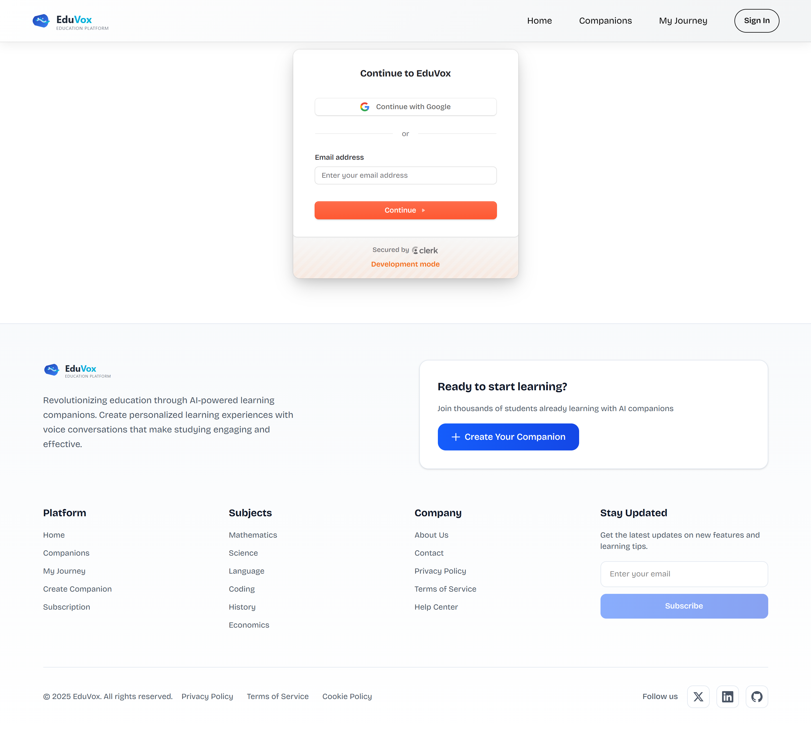
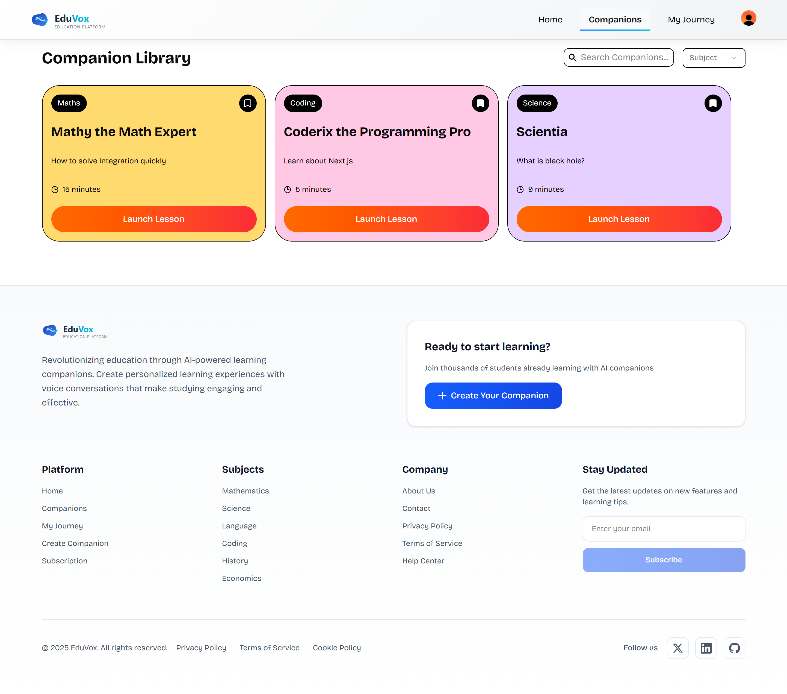
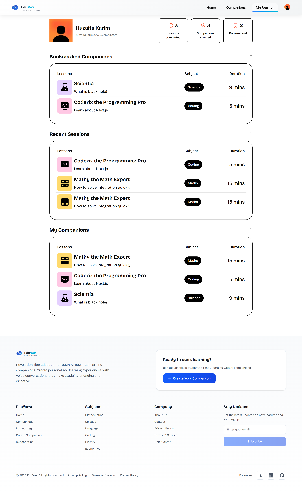

# 🎓 EduVox AI – AI-Powered Educational Voice Companion Platform


🌐 **Live Demo:** [Coming Soon - Deploy to Production](#)

## **Deployed on Vercel**

---

## 📋 Overview

**EduVox AI** is a revolutionary **AI-powered educational platform** that creates personalized voice-based learning companions for students. It combines cutting-edge voice AI technology with educational expertise to deliver **interactive, real-time learning sessions** across multiple subjects.

Key highlights include:

- **Real-time voice conversations** with AI tutors using advanced speech synthesis and recognition
- **Personalized AI companions** for Mathematics, Science, Language, History, Coding, and Economics
- **Intelligent session management** with progress tracking and conversation limits
- **Secure authentication** and user data management with automatic cleanup
- **Modern, responsive UI** built with Next.js 15, React 19, and Tailwind CSS 4
- **Scalable architecture** with real-time database and webhook integrations

---

## 🏗️ Features

### 🤖 **AI-Powered Voice Companions**

- **Subject-Specific Tutors** across 6 major academic areas
- **Real-time Voice Interaction** with natural conversation flow
- **Personalized Learning Paths** tailored to individual topics
- **Multiple Voice Options** (Male/Female, Casual/Formal styles)
- **Dynamic Session Duration** (1-60 minutes)

### 🎯 **Educational Subjects**

- **📊 Mathematics** - Calculus, Algebra, Statistics, and more
- **🔬 Science** - Physics, Chemistry, Biology concepts
- **📚 Language** - Literature, Grammar, Vocabulary building
- **🏛️ History** - World events, Historical analysis
- **💻 Coding** - Programming concepts, Logic building
- **💰 Economics** - Market principles, Economic theory

### 🎨 **Companion Customization**

- **Custom Names** with content filtering
- **Topic Specification** with relevance validation
- **Voice Selection** (ElevenLabs AI voices)
- **Teaching Style** (Casual or Formal approach)
- **Session Duration** control

### 📊 **Smart Session Management**

- **Conversation Limits** (Free: 5/month, Premium: 50/month)
- **Session History** tracking and analytics
- **Bookmark System** for favorite companions
- **Popular Companions** discovery
- **Recent Sessions** quick access

### 🔐 **Authentication & Security**

- **Clerk Authentication** with OAuth support
- **Secure User Management** with automatic data cleanup
- **Webhook Integration** for account deletion handling
- **GDPR Compliant** data processing
- **Real-time Error Tracking** with Sentry

### 📱 **Modern UX/UI**

- **Responsive Design** (Mobile-first approach)
- **Lottie Animations** for enhanced user experience
- **Form Validation** with real-time feedback
- **Accessibility** optimized components

---

## 💻 Technologies Used

### **Frontend Framework**

- [**Next.js 15.5.2**](https://nextjs.org/) — React-based full-stack framework with App Router
- [**React 19.1.0**](https://reactjs.org/) — Modern UI library with concurrent features
- [**TypeScript 5**](https://www.typescriptlang.org/) — Type-safe JavaScript development

### **Styling & UI Components**

- [**Tailwind CSS 4**](https://tailwindcss.com/) — Utility-first CSS framework
- [**Radix UI**](https://www.radix-ui.com/) — Accessible, unstyled UI primitives
- [**Class Variance Authority**](https://cva.style/) — Component variant management
- [**Tailwind Merge**](https://github.com/dcastil/tailwind-merge) — Intelligent Tailwind class merging
- [**Lucide React**](https://lucide.dev/) — Beautiful & consistent icon library
- [**Lottie React**](https://github.com/Gamote/lottie-react) — Smooth animations

### **AI & Voice Technology**

- [**Vapi AI 2.3.10**](https://vapi.ai/) — Real-time voice AI platform
- [**OpenAI GPT-4**](https://openai.com/) — Advanced language model for tutoring
- [**ElevenLabs**](https://elevenlabs.io/) — High-quality voice synthesis
- [**Deepgram Nova-3**](https://deepgram.com/) — Advanced speech-to-text transcription

### **Backend & Database**

- [**Supabase 2.57.4**](https://supabase.io/) — PostgreSQL database with real-time features
- [**Clerk 6.31.10**](https://clerk.com/) — Authentication and user management
- [**Svix 1.76.1**](https://svix.com/) — Webhook management and delivery

### **Form Handling & Validation**

- [**React Hook Form 7.62.0**](https://react-hook-form.com/) — Performant forms with minimal re-renders
- [**Zod 4.1.5**](https://zod.dev/) — TypeScript-first schema validation
- [**Hookform Resolvers 5.2.1**](https://github.com/react-hook-form/resolvers) — Form validation integration

### **Monitoring & Analytics**

- [**Sentry 10.11.0**](https://sentry.io/) — Error tracking and performance monitoring

### **Development & Build Tools**

- [**Turbopack**](https://turbo.build/pack) — Fast bundler for development and production
- [**ESLint 9**](https://eslint.org/) — Code linting and quality assurance
- [**PostCSS 4**](https://postcss.org/) — CSS post-processing

### **Web Technologies**

- [**JavaScript ES2020+**](https://developer.mozilla.org/en-US/docs/Web/JavaScript) — Modern programming language
- [**HTML5**](https://developer.mozilla.org/en-US/docs/Web/HTML) — Semantic markup
- [**CSS3**](https://developer.mozilla.org/en-US/docs/Web/CSS) — Advanced styling and animations

---

## 🚀 Getting Started

### **Prerequisites**

- Node.js 18+ installed
- npm or yarn package manager
- Supabase account and project
- Clerk account for authentication
- Vapi AI account for voice features

### **Installation**

1. **Clone the repository**

```bash
git clone https://github.com/huzaifa-fullstack/eduvox-ai.git
cd eduvox-ai
```

2. **Install dependencies**

```bash
npm install
```

3. **Environment Setup**

Create a `.env.local` file with the following variables:

```env
# Clerk Authentication
NEXT_PUBLIC_CLERK_PUBLISHABLE_KEY=your_clerk_publishable_key
CLERK_SECRET_KEY=your_clerk_secret_key
NEXT_PUBLIC_CLERK_SIGN_IN_URL=/sign-in
NEXT_PUBLIC_CLERK_SIGN_IN_FALLBACK_REDIRECT_URL=/
CLERK_WEBHOOK_SECRET=your_webhook_secret

# Supabase
NEXT_PUBLIC_SUPABASE_URL=your_supabase_url
NEXT_PUBLIC_SUPABASE_ANON_KEY=your_supabase_anon_key
SUPABASE_SERVICE_ROLE_KEY=your_supabase_service_role_key

# Vapi AI Voice
NEXT_PUBLIC_VAPI_WEB_TOKEN=your_vapi_token

# Sentry Error Tracking
SENTRY_AUTH_TOKEN=your_sentry_token

# Newsletter (Optional)
BUTTONDOWN_API_KEY=your_buttondown_key
```

4. **Database Setup**

Set up your Supabase database with the following tables:

- `companions` - AI companion configurations
- `user_lifetime_stats` - User statistics and limits
- `session_history` - Learning session records
- `bookmarks` - User bookmarked companions

5. **Start development server**

```bash
npm run dev
```

6. **Open your browser**

```
http://localhost:3000
```

7. **Build for production**

```bash
npm run build
npm start
```

---

## 📸 Screenshots

### 🔐 **Authentication Page**



---

### 🏠 **Homepage - Popular Companions**


---

### 🤖 **All Companions Discovery**



---

### �️ **Companion Builder**


---

### 🎓 **Voice Learning Session**


---

### 📊 **My Learning Journey**



---

### 💳 **Subscription Plans**


---

### 🔖 **Bookmarked Companions**


---

## 🎥 Preview


---

## 🗄️ Database Schema

### **Companions Table**

```sql
- id (uuid, primary key)
- name (text) - Companion name
- subject (text) - Academic subject
- topic (text) - Specific learning topic
- voice (text) - Voice type (male/female)
- style (text) - Teaching style (casual/formal)
- duration (integer) - Session duration in minutes
- author (text) - Creator user ID
- created_at (timestamp)
```

### **User Lifetime Stats Table**

```sql
- user_id (text, primary key)
- conversations_count (integer) - Monthly conversation count
- created_at (timestamp)
- updated_at (timestamp)
```

### **Session History Table**

```sql
- id (uuid, primary key)
- user_id (text) - User identifier
- companion_id (uuid) - Companion reference
- created_at (timestamp)
```

### **Bookmarks Table**

```sql
- id (uuid, primary key)
- user_id (text) - User identifier
- companion_id (uuid) - Bookmarked companion
- created_at (timestamp)
```

---

## 🎨 Design System

### **Color Palette**

- **Science:** `#E5D0FF` (Purple tint)
- **Mathematics:** `#FFDA6E` (Golden yellow)
- **Language:** `#BDE7FF` (Sky blue)
- **Coding:** `#FFC8E4` (Pink tint)
- **History:** `#FFECC8` (Warm amber)
- **Economics:** `#C8FFDF` (Mint green)

### **Component Architecture**

- **Atomic Components** - Reusable UI elements
- **Compound Components** - Complex interactive features
- **Layout Components** - Page structure and navigation
- **Form Components** - Input validation and submission

### **Voice Configuration**

```typescript
voices = {
  male: {
    casual: "2BJW5coyhAzSr8STdHbE",
    formal: "c6SfcYrb2t09NHXiT80T",
  },
  female: {
    casual: "ZIlrSGI4jZqobxRKprJz",
    formal: "sarah",
  },
};
```

---

## 🔒 Security & Privacy

### **Authentication Security**

- **OAuth Integration** with Clerk
- **Session Management** with automatic token refresh
- **Route Protection** for authenticated areas
- **Role-based Access Control**

### **Data Protection**

- **GDPR Compliant** user data handling
- **Automatic Data Cleanup** on account deletion
- **Webhook Security** with signature verification
- **Environment Variable Protection**

### **Content Safety**

- **Input Validation** with Zod schemas
- **Content Filtering** for inappropriate material
- **Topic Relevance Validation**
- **XSS Protection** with TypeScript

### **Error Handling**

- **Graceful Error Recovery**
- **User-friendly Error Messages**
- **Comprehensive Logging** with Sentry
- **Webhook Failure Handling**

---

## 📈 Performance Optimizations

### **Frontend Performance**

- **React 19 Concurrent Features** for smooth UI
- **Next.js App Router** with optimized routing
- **Turbopack** for fast development builds
- **Code Splitting** at route level
- **Image Optimization** with Next.js Image

### **Voice AI Optimization**

- **Streaming Audio** for real-time conversation
- **Voice Synthesis Caching**
- **Efficient Transcription** with Deepgram Nova-3
- **WebRTC** for low-latency communication

### **Database Performance**

- **Supabase Edge Functions** for server-side logic
- **Real-time Subscriptions** for live updates
- **Efficient Query Patterns**
- **Connection Pooling**

---

## 🔄 Deployment & DevOps

### **Build Commands**

```bash
npm run dev          # Development with Turbopack
npm run build        # Production build with Turbopack
npm run start        # Production server
npm run lint         # Code quality check
```

### **Deployment Platforms**

- **Vercel** (Recommended) - Optimized for Next.js
- **Netlify** - Static site deployment
- **Railway** - Full-stack deployment
- **Self-hosted** - Docker container ready

### **Environment Configuration**

- **Development** - Hot reload with Turbopack
- **Staging** - Preview deployments
- **Production** - Optimized builds

---

## 🎯 AI Assistant Configuration

### **OpenAI GPT-4 Setup**

```typescript
model: {
  provider: "openai",
  model: "gpt-4",
  messages: [
    {
      role: "system",
      content: `You are a highly knowledgeable tutor teaching a real-time voice session with a student. Your goal is to teach the student about the topic and subject.

      Tutor Guidelines:
      - Stick to the given topic and subject
      - Keep conversation flowing smoothly
      - Check student understanding regularly
      - Break down complex topics into smaller parts
      - Keep responses short for voice conversation
      - No special characters in responses`
    }
  ]
}
```

### **Voice Configuration**

```typescript
voice: {
  provider: "11labs",
  voiceId: selectedVoiceId,
  stability: 0.5,
  similarityBoost: 0.75,
  useSpeakerBoost: true
}
```

### **Transcription Setup**

```typescript
transcriber: {
  provider: "deepgram",
  model: "nova-3",
  language: "en"
}
```

---

## 🚧 Future Enhancements

- [ ] **Multi-language Support** - International education
- [ ] **Advanced Analytics** - Learning progress tracking
- [ ] **Collaborative Learning** - Group study sessions
- [ ] **Mobile App** - iOS and Android applications
- [ ] **Offline Mode** - Downloaded content access
- [ ] **Integration APIs** - LMS and school platforms
- [ ] **Advanced AI Models** - Subject-specific fine-tuning
- [ ] **Gamification** - Points, badges, and leaderboards
- [ ] **Parent Dashboard** - Progress monitoring for parents
- [ ] **Teacher Tools** - Classroom management features

---

## 📊 Project Metrics

### **Codebase Statistics**

- **Components:** 25+ React components
- **Routes:** 12 application routes
- **API Endpoints:** 8 serverless functions
- **Database Tables:** 4 core tables
- **Types:** 30+ TypeScript interfaces
- **Lines of Code:** 5,000+ (excluding node_modules)

### **Key Features Count**

- **6 Educational Subjects** supported
- **4 Voice Options** (Male/Female × Casual/Formal)
- **Real-time Voice Processing**
- **Secure Authentication System**
- **Comprehensive Form Validation**
- **Responsive Design System**
- **Error Tracking & Monitoring**
- **Webhook Integration**

---

## 🎓 Educational Impact

### **Learning Benefits**

- **Interactive Voice Learning** - More engaging than text
- **Personalized Tutoring** - AI adapts to student needs
- **Accessible Education** - Voice-based learning for all
- **Flexible Scheduling** - Learn anytime, anywhere
- **Progress Tracking** - Monitor learning journey

### **Academic Subjects Coverage**

- **STEM Education** - Math, Science, Coding
- **Humanities** - Language, History
- **Social Sciences** - Economics
- **Skill Development** - Critical thinking, problem-solving

---

## 🛠️ Development Journey

### **Problem Identification**

Traditional online learning lacks the personal touch and real-time interaction that makes education engaging. EduVox AI bridges this gap by providing AI-powered voice tutors that can adapt to individual learning styles and provide immediate feedback.

### **Solution Architecture**

- **Modern web technologies** for seamless user experience
- **Advanced AI integration** for intelligent tutoring
- **Scalable cloud infrastructure** for global accessibility
- **Security-first approach** for student data protection

### **Technical Challenges Solved**

- **Real-time voice processing** with minimal latency
- **Intelligent topic validation** to ensure educational relevance
- **Scalable user management** with conversation limits
- **Secure webhook handling** for data cleanup
- **Responsive design** across all device types

---

## 🤝 Contributing

Contributions are welcome! Please feel free to submit a Pull Request.

### **Development Workflow**

1. Fork the repository
2. Create a feature branch
3. Commit your changes
4. Push to the branch
5. Open a Pull Request

### **Code Standards**

- **TypeScript** for type safety
- **ESLint** for code quality
- **Prettier** for code formatting
- **Conventional Commits** for clear history

---

## 📄 License

This project is licensed under the [MIT License](LICENSE) - see the [LICENSE](LICENSE) file for details.

---

## ✍️ Author

**Muhammad Huzaifa Karim**  
[GitHub Profile](https://github.com/huzaifakarim1)

---

## 🙏 Acknowledgments

- **OpenAI** for GPT-4 language model
- **ElevenLabs** for voice synthesis technology
- **Deepgram** for speech recognition
- **Vapi AI** for voice AI platform
- **Supabase** for backend infrastructure
- **Clerk** for authentication services
- **Vercel** for deployment platform

---

## 📬 Contact

For questions, feedback, or support:

- Open an issue on GitHub
- Email: karimhuzaifa590@gmail.com

---

## 🌟 Show Your Support

If you found this project helpful, please consider:

- ⭐ Starring the repository
- 🐛 Reporting bugs
- 💡 Suggesting new features
- 📢 Sharing with others

---

© 2025 Muhammad Huzaifa Karim | EduVox AI
